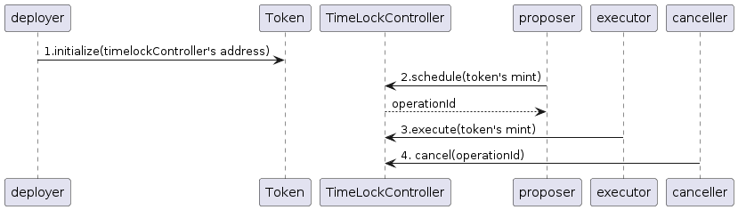
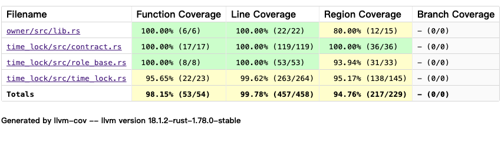

# Time Lock Project

## Project Structure

- /example

  client script to guide how to use time lock

- /owner

  ownable library

- /time_lock

  TimeLockController contract

- /tests

  unit cases of time lock

## Time Lock Functions

- grant_role

The owner of the timelock add proposer, executor, or canceller roles. If `self_managed` is false, invoking `grant-role` must go through the timelock process.

- revoke_role

The owner of the timelock revoke proposer, executor, or canceller roles. If `self_managed` is false, invoking `revoke-role` must go through timelock process.

- update_owner

The owner can transfer their rights to someone else. If `self_managed` is false, invoking `update_owner` must go through timelock process.

- schedule

Only users with the proposer role can call this function to schedule a smart contract invocation..

- execute

Only users with the executor role can call this function to execute a smart contract invocation.

- cancel

Only users with the canceller role can call this function to cancel a smart contract invocation.

- update_min_delay

The owner of the timelock can update the minimum delay for each scheduled operation. If `self_managed` is false, invoking `update_min_delay` must go through timelock process.

- get_schedule_lock_time

Get the timestamp at which an operation becomes ready. 0 for unset operation; 1 for done operation

- has_role

Verify whether a user holds a specific role.

## Time Lock Example Usage Workflow

Let's briefly introduce the flow mentioned in the above diagram:

Step 1:
After deployed the Token smart contract, the deployer call initialize function with timelock as admin  to initialize the token contract.The TimeLockController's instance become the admin of the deployed Token.

Step 2:
The proposer schedule Token's mint function call by invoke TimeLockController's schedule function and get the operationId.

Step 3:
Once the locked time is over, the executor can invoke TimeLockController's execute function to execute the Token's mint.

Step 4:
If the scheduled operation doesn't need execution, the user has canceller role can cancel the operation by operationId.

## Test Coverage

you can run `cargo llvm-cov --open` get the coverage report.